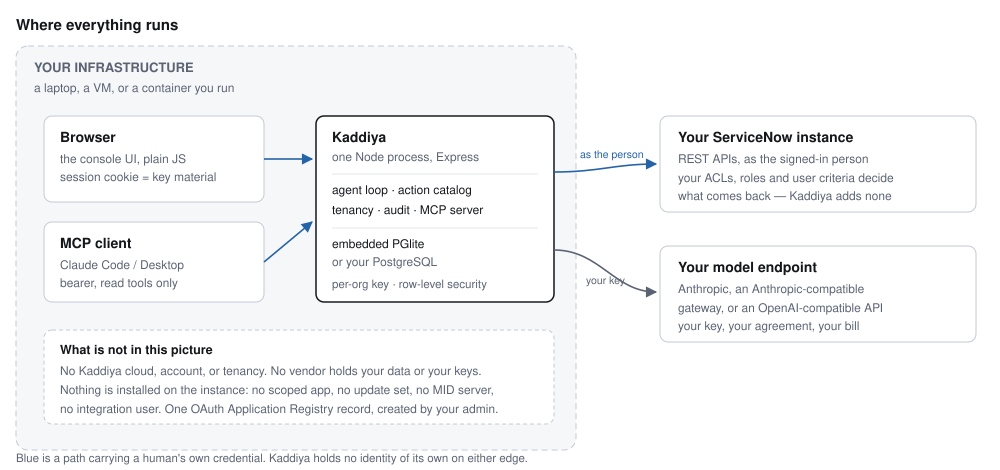
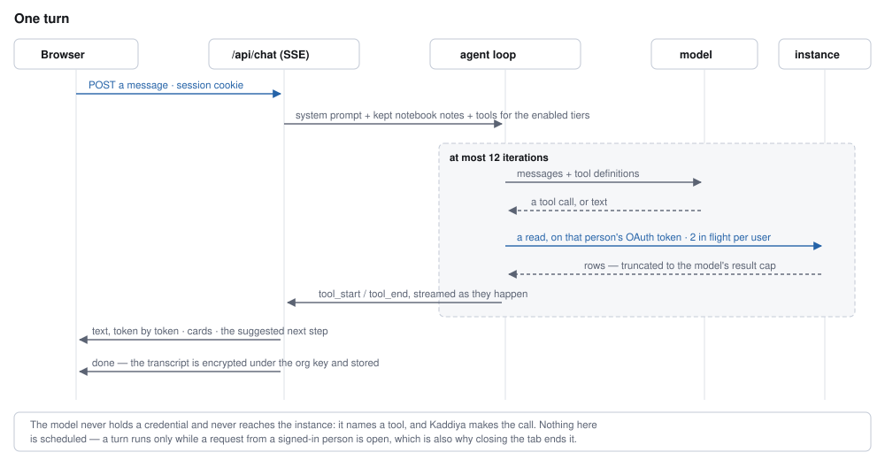
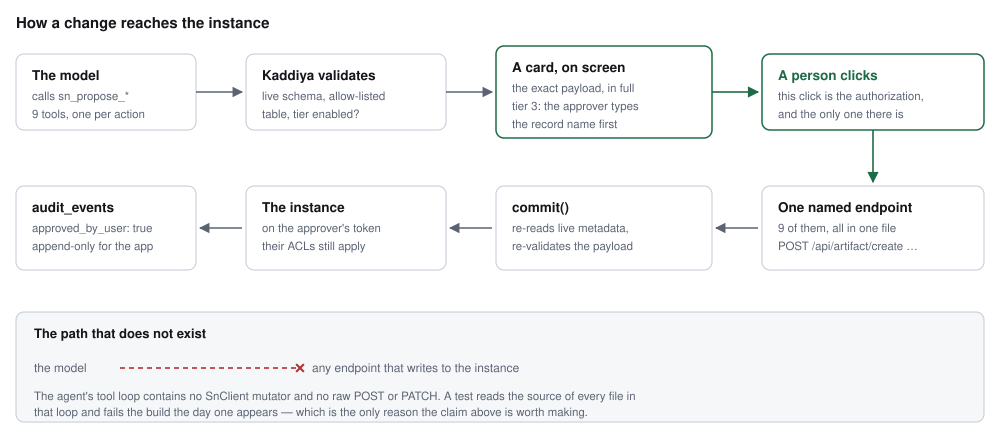
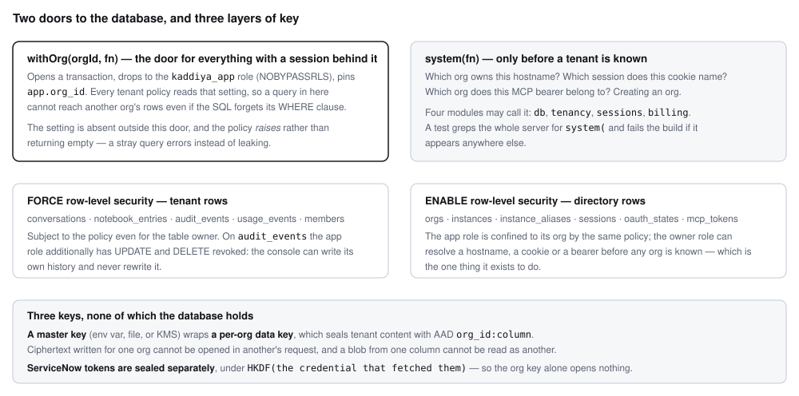

# Kaddiya — architecture

**What this is.** How Kaddiya is built: what runs where, what the agent may do, where data
lives and under which key, and what makes those claims checkable rather than promised. It is
written for an architect or a security reviewer who has been handed the product and wants to
know whether the story holds.

**What it is not.** The [approval kit](kit/README.md) answers the ServiceNow platform owner's
questions — what your instance will see, which OAuth record to create, what traffic to expect.
This document is the other side: Kaddiya's own internals. Read the kit if you are approving
instance access; read this if you are approving the software.

---

## 1. The shape of the system

Kaddiya is one Node process. It runs on the customer's own infrastructure — a laptop for an
evaluation, a container for a team — and talks to exactly two things outside itself: the
customer's ServiceNow instance, and the model endpoint the customer configured.

Three properties fall out of that shape, and most of this document is their consequences.

**There is no vendor tenancy.** No Kaddiya cloud, no Kaddiya account, no shared database. The
entire multi-tenant apparatus you would expect — an identity provider, per-tenant key
management, a tenancy layer in front of every query — still exists in the code, because a
shared host may run several organizations. But in the common deployment there is one
organization, and the vendor is not in the data path at all.

**Kaddiya holds no identity on either edge.** Sign-in *is* ServiceNow, through OAuth; instance
calls carry the signed-in person's own token. The model endpoint is reached with the
customer's own key. There is no service account, no integration user, and nothing to
provision, monitor or rotate on either side. ([Kit doc 07](kit/07-service-account-question.md)
makes this argument at length, because it is the one most governance standards have no
category for.)

**Nothing is installed on the instance.** No scoped application, no update set, no business
rule, no MID server. The only artifact on the ServiceNow side is one Application Registry
record the customer's own admin creates, and deactivating it ends all access immediately.

### The pieces inside the process

| Module | What it owns |
|---|---|
| `index.js` | HTTP: routes, OAuth callbacks, SSE, the nine commit endpoints |
| `agent.js` | The turn loop, tool definitions, the provider seam |
| `actions.js` | The action catalog — every write Kaddiya can make, as data |
| `commits.js` | Performing an approved write, re-validated |
| `sn.js` | The ServiceNow client: egress guard, concurrency, refresh, retries |
| `tenancy.js` | Orgs, instances, members, model connections |
| `sessions.js` | Session and MCP-token custody |
| `keys.js` | Per-org data keys and the master key |
| `db.js` | The two database doors, migrations, row-level security |
| `mcp.js` | The read-only MCP server |
| `runs.js` | Multi-stage work (spec → review → build → test → verify) |
| `update-set-package.js` | An update set rendered as a loadable file plus a ledger |

The dependency graph is acyclic and shallow. `actions.js` in particular is pure — it names
endpoints and describes payloads, and imports nothing — so the catalog can be read, and
tested, without starting a server or holding a session.

---

## 2. Identity, and what a session actually is

Sign-in is an OAuth 2.0 authorization-code flow with PKCE (S256) against the customer's own
instance. Two details matter more than the flow itself.

**The `state` is bound to the browser that started it.** A callback completes only for that
browser, so a pasted or emailed callback URL cannot land a session on someone else's console.
This closes login-CSRF as a side effect.

**The session cookie is key material, not a lookup key.** The cookie carries a random 256-bit
secret. The database row stores `SHA-256(secret)` for lookup, and the ServiceNow token pair
sealed with AES-256-GCM under `HKDF(secret)`. The server cannot open a token unless a request
is presenting the cookie.

The consequence is worth stating plainly: **a dump of the sessions table yields zero usable
ServiceNow tokens**, and a server compromise exposes only the sessions presented during the
window. A test dumps the table and checks that no token appears in it.

Lifetimes are absolute ceilings from creation — eight hours, configurable downward by an org
admin — never sliding windows. Revocation is a matrix rather than a flag: sign-out revokes at
the issuer and deletes the row; blocking a member or disconnecting an instance marks the row
`revoke_on_present`, so the next request revokes at the issuer and deletes; silent expiry
deletes. MCP tokens are the same mechanism applied to a second credential kind.

---

## 3. A turn

The loop is bounded at twelve iterations. Each tool result is truncated to a per-model cap
(12k–30k characters) before it re-enters the context, with a note telling the model to narrow
its query rather than leaving it to guess why data is missing.

**The model never holds a credential.** It emits a tool name and arguments; Kaddiya makes the
call. There is no code path by which a model-produced string becomes a URL, a header, or a
table name that was not checked first.

### The provider seam

One internal contract — Messages-shaped parameters in, a Messages-shaped message out — and the
endpoint's dialect chosen by the connection's `kind`:

- **`anthropic`** — a direct Anthropic key, or any Anthropic Messages-compatible gateway
- **`openai`** — translated to Chat Completions, or to Responses for the models whose tool
  calling only exists there

The loop above never learns which one it got. Adding a provider is an adapter, not a change to
the agent. Each adapter has its own test suite (8 tests each) that exercises the translation
without a network.

Model endpoints configured through the browser are held to the same egress rules as instance
hostnames: HTTPS, a public DNS name, no loopback, no IP literals, no `.internal` or `.local`.

---

## 4. The write path

This is the part of the design most worth scrutiny, because it is where an AI product usually
makes a promise it cannot keep.

The catalog is nine entries. Each names the tool the model sees, the endpoint a human click
reaches, what that endpoint calls on the instance, and which tier it belongs to. It is one
file, and it fits on a page — the enumerability *is* the security argument.

| Tier | What it covers | Default |
|---|---|---|
| 1 | Task and request actions — comments, state, assignment, approvals, catalog orders | on |
| 2 | Configuration records, including executable code | off for enterprise orgs |
| 3 | Security-sensitive configuration | explicit flag, **and** the approver types the record name |

Two structural properties hold this together:

**Naming is load-bearing.** Anything that can end in an instance write is called
`sn_propose_*`, and nothing else may be. A reviewer counts write paths by reading tool names,
and so does the model.

**Validation happens twice.** Once when the card is built, and again inside `commit()` against
live metadata — because the card may have sat on screen while someone changed the instance.

### The precision the kit insists on

The OAuth access token ServiceNow issues is **read-write**. The platform has no read-only
authorization-code scope, so no OAuth client can honestly claim its token cannot write. The
claim Kaddiya makes is narrower and checkable: *the build contains no code path that writes to
the instance without a human clicking a button on the exact payload.* Customers who want that
limit enforced at their own edge rather than taken on trust have
[kit doc 04](kit/04-rest-api-access-policy.md), which does it with REST API access policies.

---

## 5. Reading, and the MCP surface

Twelve read tools: table queries, record detail with journal, schemas, aggregates, the
person's work queue, similar resolved records, table discovery, current update set and its
contents, the update set package, and release-matched ServiceNow documentation.

The same tools are exposed over Model Context Protocol at `POST /mcp`, so a member can point
Claude Code or Claude Desktop at their own instance through Kaddiya. The surface is a frozen
allow-list, not "everything that is not a proposal": a new read tool reaches MCP only when
someone adds it to that list, and a test pins the list as a subset of the read tools with no
proposal name in it.

**Why the write surface is absent there rather than approved differently.** Every Kaddiya
write ends in an audit row saying `approved_by_user: true`, and that `true` is a human click on
a card showing the payload. An MCP host has no card and no click — a `tools/call` is a model
deciding. Whatever "approve this tool call?" prompt a host may show is not something Kaddiya
can see, log, or hold anyone to. So the proposal tools stay out, and the notebook write with
them.

Each token is one person on one instance, minted only by that person through their own consent,
absolutely expiring, revocable from both sides, and rate-limited (60 calls a minute, 8 in
flight) above the two-in-flight-per-user ceiling it shares with the browser. One endpoint
outside `/mcp` accepts the same bearer — the update set package download — because that
deliverable is a file and a tool result cannot carry one.

Full behaviour and the reasoning: [ADR 0014](adr-0014-mcp-read-only.md).

---

## 6. Storage, tenancy and keys

**Storage is one of two shapes.** A local workspace is an embedded PGlite database in a data
directory — no database server, no port, no account, which is what makes `git clone && npm run
setup` a complete install. A shared host sets `DATABASE_URL` and gets managed PostgreSQL. The
same migrations and the same row-level security apply to both; only the pool differs.

**Encryption is layered rather than global.** A master key (an environment variable, a file, or
a KMS driver) wraps a per-org data key. Tenant content — conversations, notebook entries, audit
payloads, ServiceNow client secrets, model API keys — is sealed under that org's key with
`org_id:column` as additional authenticated data. Two consequences the tests pin: ciphertext
written for one org cannot be opened in another org's request even if a query somehow returned
it, and a blob from one column will not open as another.

ServiceNow tokens are deliberately *not* under the org key. They are sealed under the
credential that fetched them — the browser's cookie, or the MCP bearer — so that the org key
alone, or the database alone, opens nothing.

---

## 7. Everything that leaves the machine

| Destination | What goes | On whose behalf | What constrains it |
|---|---|---|---|
| The ServiceNow instance | REST API reads; approved writes | The signed-in person, their OAuth token | Host and protocol pinned per session; redirects refused, not followed |
| The model endpoint | The conversation, tool results, the system prompt | The organization, its own API key | HTTPS and public-DNS check at configuration time |
| Google Fonts | Two font families, fetched by the **browser** | The person viewing the page | Content-Security-Policy `font-src`; nothing else is allowed |

That is the complete list. There is no telemetry, no analytics, no error reporting service, no
support widget, and no "phone home" — which is a deliberate contrast with how most AI tools in
this category are built, and one fewer data-processing agreement for a security team to
negotiate.

Every instance call carries `X-Kaddiya-Org`, `X-Kaddiya-User` and `X-Kaddiya-Surface` alongside
a versioned `User-Agent`, so the customer's own `syslog_transaction` attributes Kaddiya's
traffic to the human who caused it without needing Kaddiya's logs. The client refuses non-HTTPS
and any host other than the one the session is bound to, holds two calls in flight per user,
honours `Retry-After` on 429 at most twice, and refreshes exactly once on a 401 rather than
looping.

The browser side is locked down to match: `default-src 'none'`, no `unsafe-inline`, no
`unsafe-eval`, and a markdown renderer that emits an allow-list of tags with no `<a>`, no
``, no URLs and no event handlers — because model output and instance field values are
both untrusted input, and the session cookie is key material.

---

## 8. Deployment shapes

| | Local workspace | Shared host | Docker |
|---|---|---|---|
| Storage | Embedded PGlite in `data/` | Your PostgreSQL 15+ | Volumes |
| Setup | `npm run setup`, browser guide | `.env` + reverse proxy + `npm start` | `npm run setup:docker` |
| TLS | Loopback, plain HTTP | Yours, `BASE_URL` must be HTTPS | Yours |
| Master key | Generated to a file, with a warning | Injected from your secret manager | Your `.env` |
| Who it is for | One person evaluating | A team | Teams who prefer containers |

The local launcher is deliberately not a miniature of the production path: it exists so that a
developer with Node and no administrator rights can be running in five minutes. Anything
shared should use PostgreSQL, HTTPS and a real secret manager.

---

## 9. How the claims stay true

Every architectural claim in this document has a test that fails the build when it stops being
true. This is the part worth auditing, because it is the difference between a design document
and a description of the software.

| Gate | What would have to break for it to pass wrongly |
|---|---|
| The agent's tool loop reaches no instance write | Someone imports a mutator into `agent.js`, `mcp.js` or the packager |
| The tool catalog is exactly the read tools plus the action catalog | A tool is added that no one reviewed |
| The MCP surface is a subset of the read tools | A proposal or the notebook write is exposed to a host |
| Every instance write is audited as human-approved | A commit path forgets its audit row |
| Every table with an `org_id` has RLS with `USING` **and** `WITH CHECK` | A migration adds a tenant table without a policy |
| Two seeded orgs never see each other's rows | Tenant isolation regresses in any of five tables |
| A tenant query outside `withOrg()` errors rather than returning rows | The policy stops raising on a missing setting |
| `audit_events` is append-only for the app role | A grant is loosened |
| The directory role appears only in four modules | `system(` spreads into application code |
| A session dump contains no usable token | Token custody changes |
| Ciphertext does not cross orgs or columns | The AAD binding is weakened |
| No more than two instance calls per user are in flight | The stewardship promise to the platform owner regresses |
| The CSP never grants `unsafe-inline` or `unsafe-eval` | An inline script or style returns to `public/` |
| Model output reaches the page as text, never markup | The renderer's allow-list is widened |

165 tests across 24 files, run on Windows, macOS and Linux, plus a separate PostgreSQL suite
and a fresh setup-and-restart check.

---

## 10. Known limits

Stated here rather than discovered later.

- **One instance maps to one workspace.** A managed service provider reselling a single
  domain-separated instance to several end customers is unsupported.
- **A turn is attended.** Nothing is scheduled and nothing runs in the background: a stage runs
  only while a request from a signed-in person is open. That is a deliberate security
  position, but it also means a long build does not survive a closed laptop.
- **Instance-side enforcement cannot restrict which *field* a PATCH writes.** ServiceNow's REST
  API access policies work at API, method and table granularity. The restriction to `comments`
  and `work_notes` is enforced in Kaddiya's endpoint and by the customer's ACLs.
- **Prompts and tools are developed against Claude.** Other models are supported, not
  parity-guaranteed.
- **Rate limits are per process.** N replicas have N times them, as does the in-flight gate.
- **No background script execution.** Kaddiya reads the instance through documented REST APIs
  only. This costs real introspection depth — some questions about how an instance behaves are
  only answerable by running a script — and is a deliberate trade rather than an oversight.

### A gap in the record

The code cites decision records — ADR 0008 through 0013 — **209 times**, and only
[ADR 0014](adr-0014-mcp-read-only.md) is in the repository. The decisions themselves are
described in the module headers that cite them, which is how this document was assembled, but a
reviewer following a citation will not find its document. That is a documentation debt worth
paying before an external security review, not a gap in the software.

---

*Kaddiya is an early product. Validate its behaviour on sub-production data before production
use. Kaddiya is not affiliated with or endorsed by ServiceNow.*
